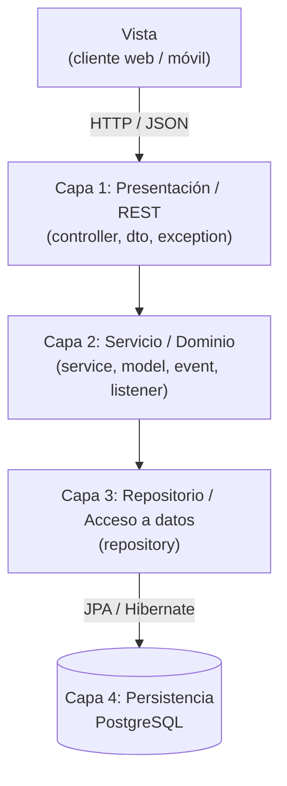
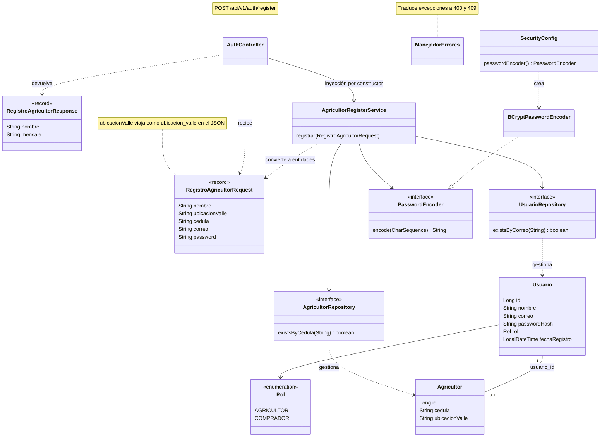
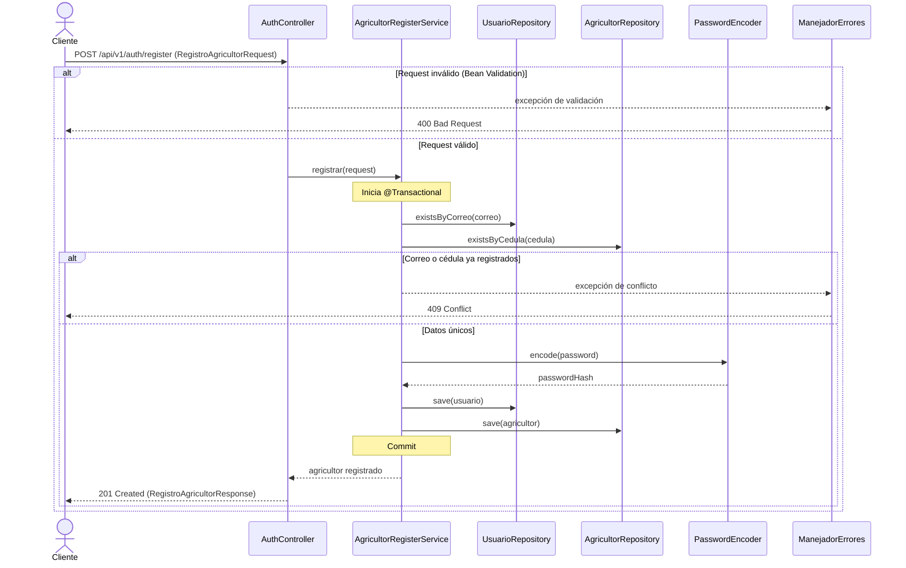
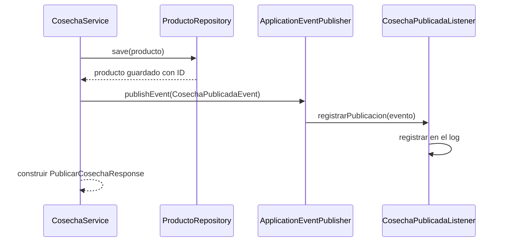

# Arquitectura MVC de 4 capas y patrones de diseño - AgroValle Connect

Documento de diseño asociado a la tarea **T03-DIS (#76)**, parte del Sprint de Diseño (#73).

## 1. Contexto y objetivo

AgroValle Connect es una aplicación backend construida con **Java 25, Spring Boot, JPA y PostgreSQL**, que expone una API REST versionada (`/api/v1`). Este documento describe cómo se organiza el sistema en cuatro capas siguiendo el patrón MVC, qué responsabilidad tiene cada una y qué patrones de diseño se aplican en el código.

Objetivos del diseño:

- **Mantenibilidad**: separar responsabilidades para que un cambio afecte a una sola capa.
- **Adecuación funcional**: concentrar las reglas de negocio en un punto único y testeable.

> **Estado actual:** las cuatro capas están implementadas en `develop`. El flujo de referencia es el registro de agricultores: `AuthController` (`POST /api/v1/auth/register`) → `AgricultorRegisterService` → repositorios → PostgreSQL, con `ManejadorErrores` como manejador central de errores.

## 2. Arquitectura en 4 capas

Al ser una API REST, la **Vista (View)** es el cliente externo (aplicación web o móvil) que consume los endpoints JSON. El backend se organiza en cuatro capas:

| # | Capa | Responsabilidad | Paquetes / componentes |
|---|---|---|---|
| 1 | Presentación / REST | Recibir peticiones HTTP, validar los DTO de entrada, devolver respuestas y traducir errores a códigos HTTP | `controller` (`AuthController`), `dto` (`RegistroAgricultorRequest`, `RegistroAgricultorResponse`), `exception` (`ManejadorErrores`) |
| 2 | Servicio / Dominio | Reglas de negocio, validaciones de unicidad, hash de contraseña, control transaccional, entidades y comunicación por eventos | `service` (`AgricultorRegisterService`, `CosechaService`), `model` (`Usuario`, `Agricultor`), `event` (`CosechaPublicadaEvent`), `listener` (`CosechaPublicadaListener`) |
| 3 | Repositorio / Acceso a datos | Consultas y persistencia mediante Spring Data JPA | `repository` (`UsuarioRepository`, `AgricultorRepository`) |
| 4 | Persistencia | Almacenamiento relacional | PostgreSQL |

El paquete `config` (por ejemplo `SecurityConfig`, que declara el bean de `PasswordEncoder`) es transversal a las capas.

Las entidades de `model` pertenecen al **Dominio**: el repositorio las usa para mapearlas a las tablas, pero nunca salen por la API.

### 2.1 Diagrama de capas


```mermaid
flowchart TD
    V["Vista<br/>(cliente web / móvil)"]
    P["Capa 1: Presentación / REST<br/>(controller, dto, exception)"]
    S["Capa 2: Servicio / Dominio<br/>(service, model, event, listener)"]
    R["Capa 3: Repositorio / Acceso a datos<br/>(repository)"]
    DB[("Capa 4: Persistencia<br/>PostgreSQL")]

    V -->|HTTP / JSON| P
    P --> S
    S --> R
    R -->|JPA / Hibernate| DB
```

### 2.2 Reglas de dependencia

- Cada capa solo se comunica con la capa inmediatamente inferior (Presentación → Servicio → Repositorio → Persistencia).
- Un `Controller` **nunca** accede directamente a un `Repository`.
- Las entidades (`model`) no se exponen en la API: la entrada y la salida usan DTO (`Request` y `Response`).
- La lógica de negocio y el manejo de transacciones (`@Transactional`) viven únicamente en `service`.
- Los errores se traducen a respuestas HTTP en un único punto (`ManejadorErrores`), no en cada controlador.

### 2.3 Estructura de paquetes

```
src/main/java/com/agrovalleconnect/agrovalle_connect/
├── AgrovalleConnectApplication.java
├── config/
│   └── SecurityConfig.java
├── controller/
│   └── AuthController.java
├── dto/
│   ├── RegistroAgricultorRequest.java
│   └── RegistroAgricultorResponse.java
├── event/
│   └── CosechaPublicadaEvent.java
├── exception/
│   └── ManejadorErrores.java
├── listener/
│   └── CosechaPublicadaListener.java
├── model/
│   ├── Agricultor.java
│   └── Usuario.java
├── repository/
│   ├── AgricultorRepository.java
│   └── UsuarioRepository.java
└── service/
    ├── AgricultorRegisterService.java
    └── CosechaService.java
```

## 3. Diagrama de clases


```mermaid
classDiagram
    class AuthController
    class RegistroAgricultorRequest {
        <<record>>
        String nombre
        String ubicacionValle
        String cedula
        String correo
        String password
    }
    class RegistroAgricultorResponse {
        <<record>>
        String nombre
        String mensaje
    }
    class ManejadorErrores
    class AgricultorRegisterService {
        registrar(RegistroAgricultorRequest)
    }
    class UsuarioRepository {
        <<interface>>
        existsByCorreo(String) boolean
    }
    class AgricultorRepository {
        <<interface>>
        existsByCedula(String) boolean
    }
    class Usuario {
        Long id
        String nombre
        String correo
        String passwordHash
        Rol rol
        LocalDateTime fechaRegistro
    }
    class Rol {
        <<enumeration>>
        AGRICULTOR
        COMPRADOR
    }
    class Agricultor {
        Long id
        String cedula
        String ubicacionValle
    }
    class PasswordEncoder {
        <<interface>>
        encode(CharSequence) String
    }
    class BCryptPasswordEncoder
    class SecurityConfig {
        passwordEncoder() PasswordEncoder
    }

    note for AuthController "POST /api/v1/auth/register"
    note for RegistroAgricultorRequest "ubicacionValle viaja como ubicacion_valle en el JSON"
    note for ManejadorErrores "Traduce excepciones a 400 y 409"

    AuthController --> AgricultorRegisterService : inyección por constructor
    AuthController ..> RegistroAgricultorRequest : recibe
    AuthController ..> RegistroAgricultorResponse : devuelve
    AgricultorRegisterService ..> RegistroAgricultorRequest : convierte a entidades
    AgricultorRegisterService --> UsuarioRepository
    AgricultorRegisterService --> AgricultorRepository
    AgricultorRegisterService --> PasswordEncoder
    UsuarioRepository ..> Usuario : gestiona
    AgricultorRepository ..> Agricultor : gestiona
    Usuario --> Rol
    Usuario "1" -- "0..1" Agricultor : usuario_id
    BCryptPasswordEncoder ..|> PasswordEncoder
    SecurityConfig ..> BCryptPasswordEncoder : crea
```

La relación `Usuario` - `Agricultor` es `@OneToOne`. `Agricultor` es el lado dueño de la relación (columna `usuario_id`, `unique`, `nullable = false`) y `Usuario` la mapea con `mappedBy`.

## 4. Flujo de ejemplo: registro de un agricultor


```mermaid
sequenceDiagram
    actor Cliente
    participant C as AuthController
    participant S as AgricultorRegisterService
    participant UR as UsuarioRepository
    participant AR as AgricultorRepository
    participant PE as PasswordEncoder
    participant E as ManejadorErrores

    Cliente->>C: POST /api/v1/auth/register (RegistroAgricultorRequest)
    alt Request inválido (Bean Validation)
        C-->>E: excepción de validación
        E-->>Cliente: 400 Bad Request
    else Request válido
        C->>S: registrar(request)
        Note over S: Inicia @Transactional
        S->>UR: existsByCorreo(correo)
        S->>AR: existsByCedula(cedula)
        alt Correo o cédula ya registrados
            S-->>E: excepción de conflicto
            E-->>Cliente: 409 Conflict
        else Datos únicos
            S->>PE: encode(password)
            PE-->>S: passwordHash
            S->>UR: save(usuario)
            S->>AR: save(agricultor)
            Note over S: Commit
            S-->>C: agricultor registrado
            C-->>Cliente: 201 Created (RegistroAgricultorResponse)
        end
    end
```

Respuestas posibles del endpoint:

| Código | Situación |
|---|---|
| 201 Created | Usuario y agricultor registrados correctamente |
| 400 Bad Request | El request no cumple las validaciones (campos vacíos, tamaños, formato de correo) |
| 409 Conflict | El correo o la cédula ya están registrados |

Si falla cualquier guardado, la transacción revierte tanto `Usuario` como `Agricultor`.

### 4.1 Contrato del endpoint

**Request** (`RegistroAgricultorRequest`), validado con Jakarta Validation:

| Campo (JSON) | Reglas |
|---|---|
| `nombre` | Obligatorio, máximo 50 caracteres |
| `ubicacion_valle` | Obligatoria, máximo 15 caracteres |
| `cedula` | Obligatoria, entre 6 y 10 dígitos |
| `correo` | Obligatorio, máximo 50 caracteres, formato válido (`@Pattern`) |
| `password` | Obligatoria, mínimo 8 caracteres con una mayúscula, una minúscula, un número y un carácter especial (`@$!%*?&`) |

**Response** (`RegistroAgricultorResponse`): contiene únicamente `nombre` y `mensaje`. No se devuelve el `id`, el correo ni el hash de la contraseña.

## 5. Patrones de diseño aplicados

Los patrones provienen de distintos catálogos: algunos son GoF (Gang of Four) y otros son patrones de arquitectura empresarial o principios de diseño comunes en Spring.

| Patrón | Catálogo | Dónde se aplica | Justificación |
|---|---|---|---|
| **Repository** | Arquitectura empresarial (PoEAA) | `UsuarioRepository` y `AgricultorRepository` (`JpaRepository`) | Abstrae el acceso a datos: el servicio trabaja con una interfaz de colección y no con SQL |
| **DTO** | Arquitectura empresarial (PoEAA) | `RegistroAgricultorRequest` y `RegistroAgricultorResponse` | Son `record` de Java (inmutables) que aíslan las entidades de la API: solo viaja lo necesario y el modelo interno puede cambiar sin romper el contrato |
| **IoC / inyección por constructor** | Principio de diseño (Spring) | `AuthController` y `AgricultorRegisterService` | El contenedor de Spring crea y entrega las dependencias; las clases no se instancian entre sí, lo que facilita las pruebas |
| **Builder** | GoF (creacional) | `@Builder` de Lombok en `Usuario` y `Agricultor`, usado en `registrar` | Construcción legible de entidades con muchos atributos, sin constructores largos |
| **Mapper** | Arquitectura empresarial (PoEAA) | `AgricultorMapper` convierte `RegistroAgricultorRequest` en `Usuario` y `Agricultor` | Separa el paso de DTO a entidad del servicio y del controlador |
| **Singleton** | GoF (creacional) | Beans de Spring (`@Service`, `@RestController`, `@Configuration`) | El contenedor crea una única instancia por bean (alcance singleton por defecto) |
| **Strategy** | GoF (comportamiento) | `PasswordEncoder` (interfaz) y `BCryptPasswordEncoder` (estrategia concreta) | El algoritmo de hash se puede cambiar modificando solo el bean de `SecurityConfig` |
| **Proxy** | GoF (estructural) | `@Transactional` en `AgricultorRegisterService` | Spring envuelve el servicio en un proxy (AOP) que abre, confirma o revierte la transacción |
| **Facade** | GoF (estructural) | `AgricultorRegisterService.registrar(...)` | Un único punto de entrada que oculta la coordinación de dos repositorios, el hash y la transacción |
| **Observer** | GoF (comportamiento) | `CosechaService`, `CosechaPublicadaEvent` y `CosechaPublicadaListener` | El servicio publica un evento de Spring tras guardar el producto; los observadores reaccionan sin que el servicio conozca sus implementaciones |

Nota: en **Singleton**, la instancia única la gestiona el contenedor de Spring y no una implementación manual con constructor privado.

### 5.1 Patrones propuestos para futuras historias

| Patrón | Propuesta de uso |
|---|---|
| **Factory Method** | Crear usuarios según el `Rol` (`AGRICULTOR`, `COMPRADOR`) cuando se agregue el registro de compradores |
| **Observer para usuario registrado** | Propuesta de un evento de registro de usuarios para futuras notificaciones; es un flujo distinto de `CosechaPublicadaEvent`, ya implementado para HU-02 en la sección 5.2 |

### 5.2 Observer en la publicación de cosechas (T04-HU02)

`CosechaService.publicar(...)` conserva las validaciones de finca, propietario y categoría de T03-HU02. Después de que `ProductoRepository.save(...)` devuelve el producto guardado, llama a `ApplicationEventPublisher.publishEvent(...)` con un `CosechaPublicadaEvent` del paquete `event`.

El evento es un `record` inmutable con `productoId`, `tipo`, `fincaId` y `municipio` (nombre del catálogo). Transporta valores simples, sin entidades JPA ni relaciones de carga diferida. `CosechaPublicadaListener`, en el paquete `listener`, es un componente de Spring cuyo método `@EventListener` registra esos datos en el log.


```mermaid
sequenceDiagram
    participant S as CosechaService
    participant R as ProductoRepository
    participant P as ApplicationEventPublisher
    participant L as CosechaPublicadaListener
    S->>R: save(producto)
    R-->>S: producto guardado con ID
    S->>P: publishEvent(CosechaPublicadaEvent)
    P->>L: registrarPublicacion(evento)
    L->>L: registrar en el log
    S-->>S: construir PublicarCosechaResponse
```

Si falla una validación o el guardado lanza una excepción, el servicio termina antes de emitir el evento. Con la configuración actual de Spring, la entrega al listener es síncrona y ocurre dentro de la transacción del servicio, antes de su commit. El log registra la ejecución de esa etapa; una excepción posterior todavía puede revertir la transacción.

Si un listener síncrono lanza una excepción no controlada, esta se propaga a `CosechaService` y provoca el rollback de la publicación completa conforme a las reglas de `@Transactional`. Por ello, un fallo de un observador puede impedir que se guarde la cosecha; los listeners síncronos deben reservarse para operaciones que puedan participar en esa transacción.

Para futuras notificaciones a compradores, se pueden añadir observadores del mismo evento sin modificar `CosechaService`. Los efectos externos, como correos y notificaciones, deberán ejecutarse después de confirmar la transacción mediante `@TransactionalEventListener(phase = TransactionPhase.AFTER_COMMIT)`, para evitar enviar avisos de cosechas cuyo registro se revierta.

`CosechaServiceTest` comprueba el orden guardar → emitir, el contenido del evento y su ausencia ante finca inexistente, finca ajena, categoría inválida o fallo de guardado. `CosechaPublicadaIntegrationTest` crea sus propios datos de municipio y categoría, sin depender de los catálogos sembrados al arrancar, y verifica con Spring y H2 el producto persistido, la emisión del evento y la ejecución del listener de log.

### 5.3 Principios SOLID

| Principio | Aplicación en el código | Evidencia |
|---|---|---|
| **S: responsabilidad única** | `AgricultorMapper` construye `Usuario` y `Agricultor`. `AgricultorRegisterService` orquesta validaciones y guardado. `AuthController` atiende HTTP, delega en servicios y no conoce entidades. | PR #128 y #129 |
| **O: abierto/cerrado** | `ManejadorErrores` responde 409 para `RecursoDuplicadoException`. Un duplicado nuevo se agrega como subclase, sin modificar el manejador. Un observador nuevo se agrega sin modificar `CosechaService`. | PR #128 y #130 |
| **L: sustitución de Liskov** | `CorreoDuplicadoException` y `CedulaDuplicadaException` sustituyen a su clase base. El manejador las atiende por igual y conserva el contrato: 409 con el mensaje de la excepción. | `rechazaCorreoDuplicado` y `rechazaCedulaDuplicada` |
| **I: segregación de interfaces** | `CosechaService` depende de `ApplicationEventPublisher`, que solo publica eventos, y no del contexto completo de Spring. Los DTO separan la entrada y la salida de cada caso de uso. | `CosechaService` y paquete `dto` |
| **D: inversión de dependencias** | `AgricultorRegisterService` depende de la interfaz `PasswordEncoder` y `SecurityConfig` define la implementación BCrypt. Los servicios reciben por constructor las interfaces de repositorio, lo que permite aislarlos con Mockito. | `SecurityConfig` y pruebas de servicio |

---

## 6. Relación con atributos de calidad (ISO 25010)

| Atributo | Cómo lo respalda la arquitectura |
|---|---|
| Mantenibilidad | La separación en capas, los DTO y la inyección de dependencias permiten modificar una capa sin afectar a las demás |
| Adecuación funcional | Las reglas de negocio (unicidad, hash de contraseña, atomicidad) se concentran en la capa `service` |

## 7. Decisiones de diseño

- **Contraseñas:** nunca se almacenan en texto plano; se guarda solo `passwordHash` generado con BCrypt.
- **Atomicidad:** el registro de `Usuario` y `Agricultor` ocurre en una sola transacción.
- **DTO de entrada y salida:** el cliente nunca recibe ni envía entidades. Los datos se validan con Jakarta Validation (`@NotBlank`, `@Size` y `@Pattern` para la cédula, el formato del correo y la complejidad de la contraseña) antes de llegar a la capa de negocio. La respuesta expone solo `nombre` y `mensaje`, nunca el hash ni el `id`.
- **Manejo centralizado de errores:** `ManejadorErrores` traduce las excepciones a respuestas HTTP coherentes (400 para validación y 409 para duplicados).
- **API versionada:** los endpoints cuelgan de `/api/v1` para poder evolucionar el contrato sin romper a los clientes existentes.
- **Calidad automatizada:** Checkstyle y los hooks de Husky se ejecutan en cada commit, según el Definition of Done del equipo.
