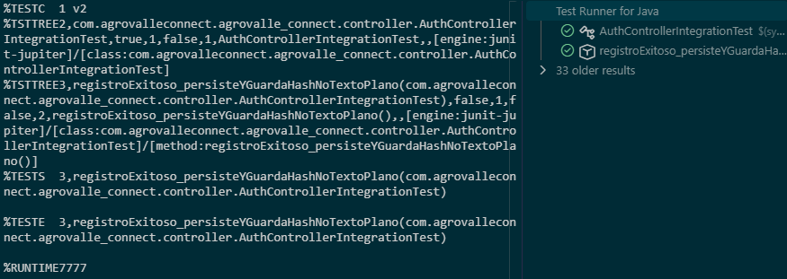
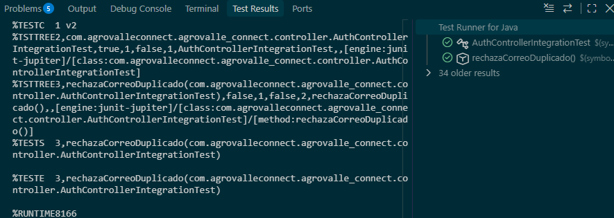
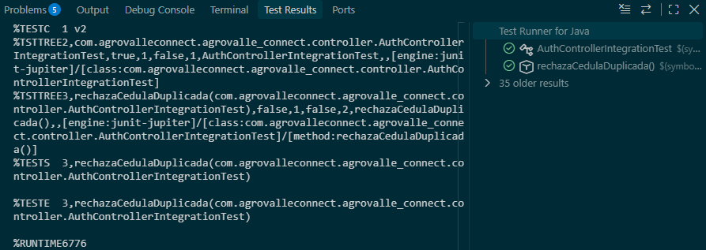
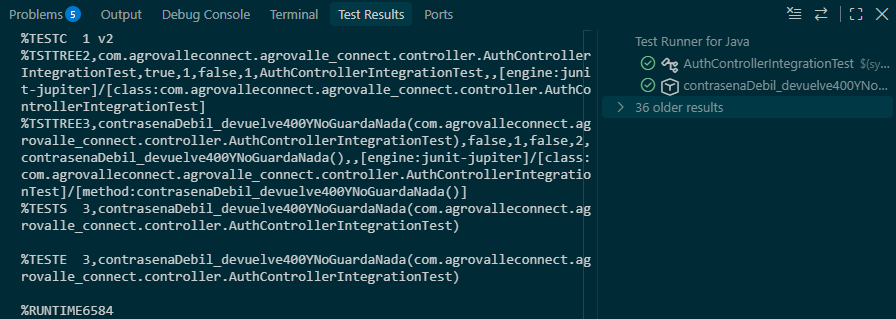
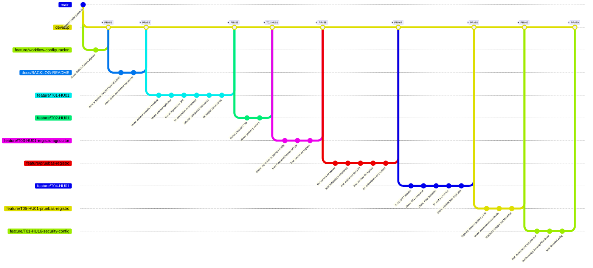

#  Sprint Review — Sprint 1 — AgroValle Connect

**Fecha de la revisión:** 30/09/2026
**Participantes:** Angel Castillo (Scrum Master), Sebastian Martinez (Backend/DBA), Juan Taborda (Frontend), Joel Mina (QA) y la docente como *stakeholder*.

---

## 1.  Sprint Goal y resultado

**Habilitar el registro inicial de agricultores del Valle del Cauca y su inicio de sesión seguro en la plataforma AgroValle Connect, validando la persistencia en PostgreSQL, la unicidad de los datos de identidad y la arquitectura REST en capas (Controller → Service → Repository), de modo que exista un usuario autenticado con token JWT que habilite las historias protegidas de los siguientes sprints.**

| Criterio del Sprint Goal | Estado | Evidencia |
| :--- | :---: | :--- |
| Registro de agricultor con `201 Created` | ✅ | `AuthController`, prueba `registroExitoso_persisteYGuardaHashNoTextoPlano` |
| Persistencia y unicidad (correo y cédula) | ✅ | Pruebas `rechazaCorreoDuplicado` y `rechazaCedulaDuplicada` (respuesta `409`) |
| Contraseña guardada con hash, no en texto plano | ✅ | Servicio con BCrypt y su prueba de integración |
| Login con token JWT (HS256) | ✅ | Solo T01-HU16 (config de seguridad) está fusionada |
| Escenarios BDD traducidos a JUnit 5 | ✅ | Cubierto para HU-01; HU-16 pendiente |

---

## 2.  Incremento entregado

| Historia | Story Points | Estado | Observación |
| :---: | :---: | :---: | :--- |
| **HU-01** Registro de Agricultores | 5 | ✅ Hecha | Cumple los 5 criterios del DoD revisados. |
| **HU-16** Inicio de Sesión | 3 | 🟧 Parcial | Base de seguridad lista; faltan servicio JWT, controlador y pruebas. |

**Velocidad:** 5 Story Points completados de 8 comprometidos (capacidad 10).
*(Actualizar si se terminan más tareas de HU-16 antes de la revisión.)*

---

## 3.  Evidencias de la demo

| # | Escenario demostrado | Petición | Resultado esperado | Captura |
| :---: | :--- | :--- | :--- | :---: |
| 1 | Registro exitoso | `POST /api/v1/auth/register` con `nombre`, `ubicacion_valle`, `cedula`, correo y contraseña válidos | `201 Created` + mensaje "Agricultor registrado exitosamente" |  |
| 2 | Correo duplicado | Mismo JSON por segunda vez | `409 Conflict` |  |
| 3 | Cédula duplicada | Otro correo con la misma cédula | `409 Conflict` |  |
| 4 | Contraseña débil | Contraseña que no cumple reglas | `400 Bad Request`, no se guarda nada |  |
| 5 | Tablero Kanban | Captura del tablero | T01–T05 de HU-01 en *Done* | * |

---

## 4.  Evidencia de Desarrollo: Historial GitFlow

El equipo trabajó con una rama `feature/` por tarea, integrada a `develop` mediante Pull Request. El siguiente diagrama se generó a partir del historial real del repositorio (26/09 al 30/09/2026).

### Resumen de Pull Requests

| PR | Rama | Tarea / Propósito | Autor principal | Fecha | Commits |
| :---: | :--- | :--- | :---: | :---: | :---: |
| **#51** | `feature/workflow-configuracion` | Pipeline de CI con GitHub Actions | Angel Castillo | 26/09 | 1 |
| **#52** | `docs/BACKLOG-README` | Actualizar `BACKLOG.md` y `README.md` | Angel Castillo | 26/09 | 2 |
| **#53** | `feature/T01-HU01` | Entidades `Usuario` y `Agricultor` + repositorios JPA | Angel Castillo | 26/09 | 10 |
| — | `feature/T02-HU01` | DTO de registro *(fusión directa, sin PR)* | Juan Taborda | 26/09 | 2 |
| **#55** | `feature/T03-HU01-registro-agricultor` | Servicio de registro con BCrypt y unicidad | Joel Mina | 27/09 | 3 |
| **#67** | `feature/pruebas-registro` | Pruebas de entidades, DTO y servicio | Angel Castillo | 28/09 | 9 |
| **#68** | `feature/T04-HU01` | `RestController` y DTO de respuesta | Angel Castillo | 29/09 | 5 |
| **#69** | `feature/T05-HU01-pruebas-registro` | Pruebas de integración con MockMvc | Sebastian Martinez | 29/09 | 3 |
| **#70** | `feature/T01-HU16-security-config` | Configuración de Spring Security | Angel Castillo | 30/09 | 3 |

| Elemento del diagrama | Significado |
| :--- | :--- |
| Línea de `main` | Código estable; solo recibe el release al cerrar el sprint. |
| Línea de `develop` | Rama de integración del equipo. |
| Ramas `feature/` | Una por tarea, de corta duración. |
| Etiqueta `PR#n` | Pull Request revisado y fusionado en `develop`. |

---

## 5.  Calidad del incremento

| Indicador | Valor | Fuente |
| :--- | :---: | :--- |
| Pruebas automatizadas | **27** métodos `@Test` | `src/test/java/...` |
| Clases de prueba | 6 | DTO, entidades/repositorios, servicio, controlador, seguridad |
| Pull Requests fusionados en el sprint | **8** (#51, #52, #53, #55, #67, #68, #69, #70) | GitHub |
| Commits (sin merges) | 51 en total del repo | `git log` |
| Pipeline de CI | Activo en cada PR | `.github/workflows/ci.yml` |
| Checkstyle + Husky | Activos en local | `.husky/pre-commit` |

---

## 6. Ajustes al Product Backlog

| Cambio | Motivo | Destino |
| :--- | :--- | :---: |
| Tareas pendientes de HU-16 (T02–T06) | No se alcanzaron a terminar debido al poco tiempo | Sprint 2 (prioridad alta)  |
| HU-02 y HU-04 | Siguen como objetivo del siguiente sprint | Sprint 2 |
